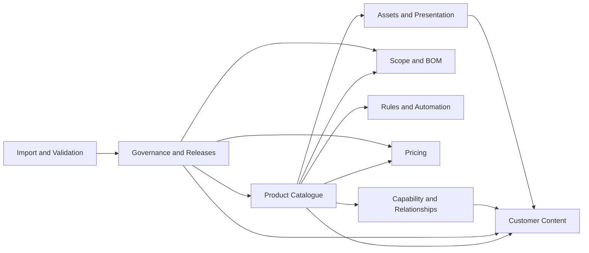
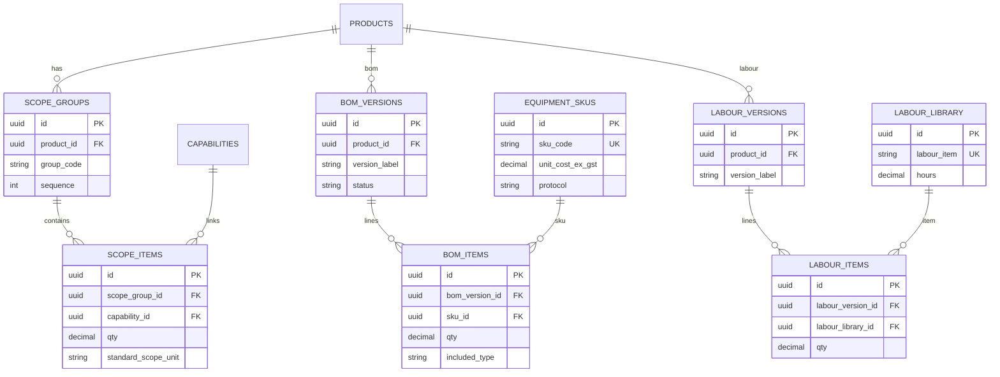
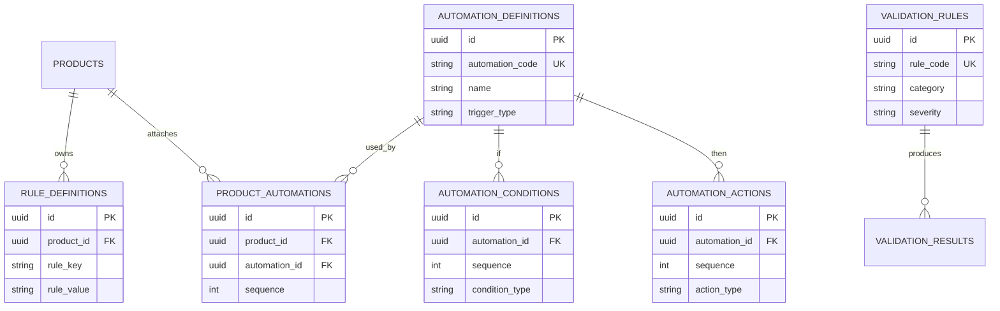
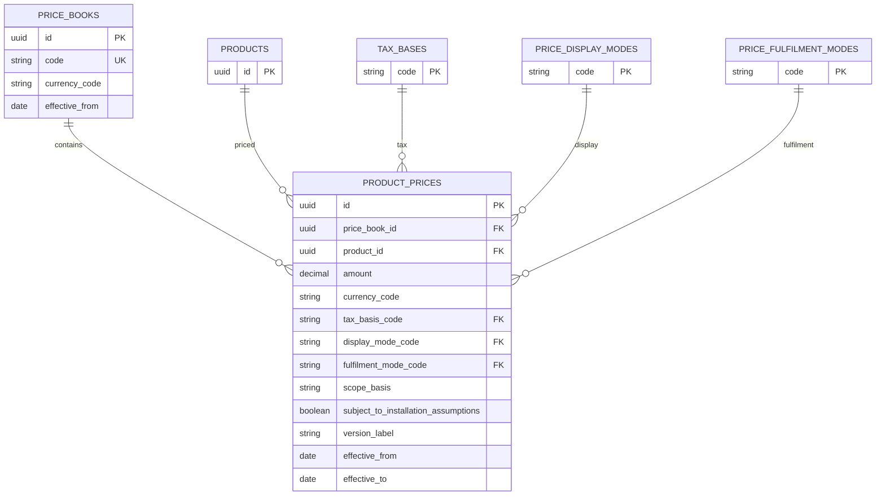
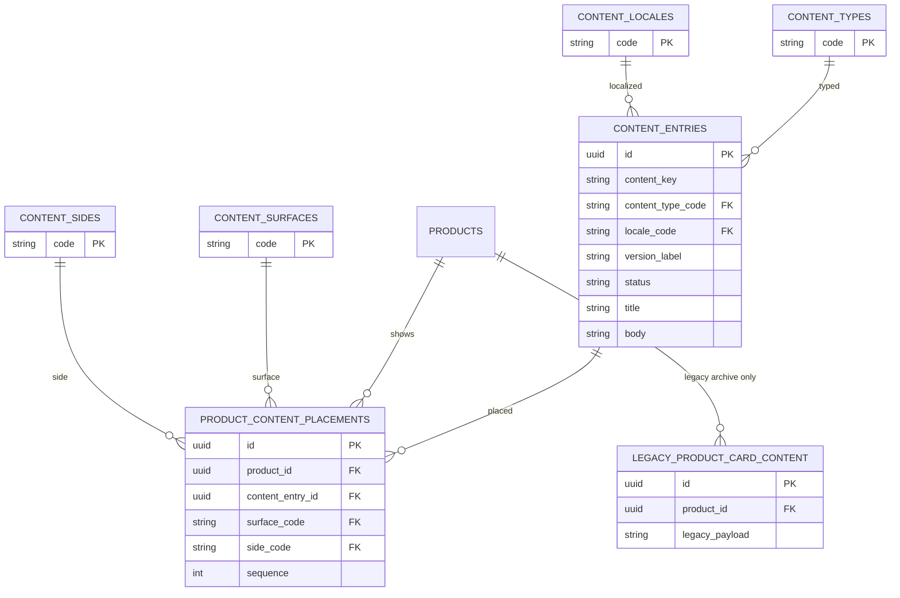
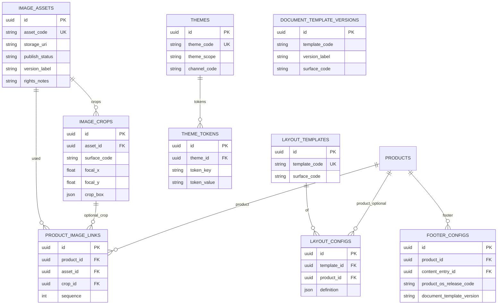
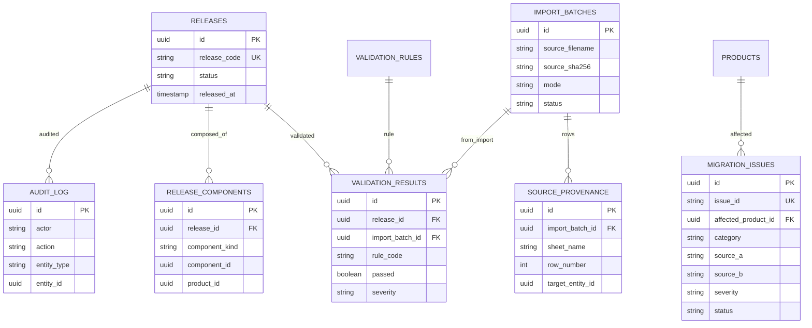

# Product OS V2 — ERD (Phase 1 Design + Phase 2A)

- Date: 2026-07-18
- Format: Mermaid erDiagram, split by bounded context for readability
- Status: Logical model — Phase 2A dual-axis taxonomy + experiences/presentation;
  **no physical migration**
- Sources: approved V2.07 + A4 snapshots; DEC-001…012 recorded

---

## Context map



---

## 1. Product Catalogue (dual-axis)

```mermaid
erDiagram
  PRODUCT_KINDS ||--o{ PRODUCTS : kind
  COMMERCIAL_ROLES ||--o{ PRODUCTS : role
  PRODUCT_STATUSES ||--o{ PRODUCTS : status
  PRODUCTS ||--o{ PRODUCT_VERSIONS : versions
  PRODUCTS ||--o| ADDON_PROFILES : "if ADDON"
  PRODUCTS ||--o{ ADDON_PARENT_ELIGIBILITY : "as addon"
  PRODUCTS ||--o{ ADDON_PARENT_ELIGIBILITY : "as parent"
  PRODUCTS ||--o{ PRODUCT_FEATURED_ADDONS : features
  PRODUCTS ||--o{ INSTALLATION_ASSUMPTIONS : assumptions
  CAPABILITIES ||--o{ ADDON_PROFILES : extends

  PRODUCT_KINDS {
    string code PK
    string label
    int hierarchy_rank
  }
  COMMERCIAL_ROLES {
    string code PK
    string label
    boolean allows_independent_purchase
    boolean requires_unlock
  }
  PRODUCT_STATUSES {
    string code PK
    boolean allows_sale
  }
  PRODUCTS {
    uuid id PK
    string product_code UK
    string canonical_name
    string product_kind_code FK
    string commercial_role_code FK
    string status_code FK
    uuid parent_product_id FK
    boolean requires_foundation
  }
  PRODUCT_VERSIONS {
    uuid id PK
    uuid product_id FK
    string version_label
    string status
  }
  ADDON_PROFILES {
    uuid product_id PK_FK
    uuid extends_capability_id FK
    boolean creates_new_room
    boolean creates_new_experience
  }
  ADDON_PARENT_ELIGIBILITY {
    uuid id PK
    uuid addon_product_id FK
    uuid parent_product_id FK
    string status
  }
  PRODUCT_FEATURED_ADDONS {
    uuid id PK
    uuid parent_product_id FK
    uuid addon_product_id FK
    int sequence
  }
  INSTALLATION_ASSUMPTIONS {
    uuid id PK
    uuid product_id FK
    string layer
    string assumption_text
  }
```

**Classification (DEC-008):** F-01 FOUNDATION+STANDARD; C-01…C-06 COLLECTION+STANDARD;
E-05 CCTV EXPERIENCE+PACK; E-06 Smart Toilet STANDALONE+STANDARD; AO-* ADDON+STANDARD.
Protection = included benefit (not a product). Legacy workbook E-05/E-06/E-07 → see `legacy-id-crosswalk.md`.

---

## 2. Capability, Experiences, Relationships

```mermaid
erDiagram
  PRODUCTS ||--o{ PRODUCT_CAPABILITY_INCLUSIONS : includes
  CAPABILITIES ||--o{ PRODUCT_CAPABILITY_INCLUSIONS : capability
  PRODUCT_CAPABILITY_INCLUSIONS ||--o{ CAPABILITY_SUPPORT_LINKS : evidence
  PRODUCTS ||--o{ PRODUCT_EXPERIENCES : experiences
  PRODUCT_EXPERIENCES ||--o{ EXPERIENCE_PRESENTATION_MAPPINGS : present_as
  PRODUCTS ||--o{ PRODUCT_RELATIONSHIPS : from
  PRODUCTS ||--o{ PRODUCT_RELATIONSHIPS : to
  RELATIONSHIP_TYPES ||--o{ PRODUCT_RELATIONSHIPS : type
  PRODUCT_RELATIONSHIPS ||--o{ RELATIONSHIP_REQUIREMENTS : requires
  PRODUCTS ||--o{ RELATIONSHIP_REQUIREMENTS : required_product
  AUTOMATION_DEFINITIONS ||--o{ PRODUCT_EXPERIENCES : optional_link
  AUTOMATION_DEFINITIONS ||--o{ EXPERIENCE_PRESENTATION_MAPPINGS : optional_link

  CAPABILITIES {
    uuid id PK
    string capability_code UK
    string name
  }
  PRODUCT_CAPABILITY_INCLUSIONS {
    uuid id PK
    uuid product_id FK
    uuid capability_id FK
    decimal included_qty
  }
  PRODUCT_EXPERIENCES {
    uuid id PK
    string experience_code UK
    uuid product_id FK
    string canonical_title
    int sequence
  }
  EXPERIENCE_PRESENTATION_MAPPINGS {
    uuid id PK
    uuid experience_id FK
    string channel
    string surface_code
    string side_code
    string display_title
    int sort_order
    string grouping
    boolean visibility
  }
  RELATIONSHIP_TYPES {
    string code PK
  }
  PRODUCT_RELATIONSHIPS {
    uuid id PK
    uuid from_product_id FK
    uuid to_product_id FK
    string relationship_type_code FK
  }
  RELATIONSHIP_REQUIREMENTS {
    uuid id PK
    uuid relationship_id FK
    uuid required_product_id FK
  }
```

**Protection Bonus:** included benefit on CCTV (E-05); unlock requirements C-01 ∧ C-06 ∧ E-05.
**presentation_cta:** Expand Further “Add-ons” (no product target required).

---

## 3. Scope and BOM



---

## 4. Rules and Automation



---

## 5. Pricing



---

## 6. Customer Content



---

## 7. Assets and Presentation



---

## 8. Governance, Releases, Import



---

## Cardinality notes
- Every product has `product_kind` × `commercial_role` (ADR-005); BONUS is not a kind.
- One product has many prices over time (versioned); never one mutable price column;
  display wording is not stored in `amount` (DEC-011).
- One product has many BOM versions; release pins one BOM version.
- Content placements bind approved content entries; layout never embeds product facts.
- Add-on eligibility is many-to-many between Add-on products and parent products.
- Bonus unlock relationships use `relationship_requirements` for multi-product gates
  (C-01 ∧ C-06 ∧ E-05 CCTV → Protection included benefit).
- Canonical experiences map 1→N to channel presentation mappings (DEC-009).
- Product OS `releases` are distinct from `document_template_versions` (DEC-005).
- Image assets with `NOT_APPROVED_FOR_PUBLISH` must not silently publish (DEC-007).
